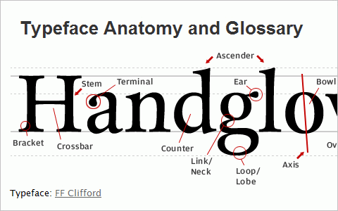
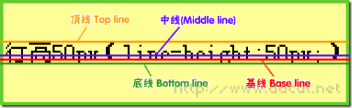
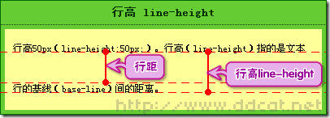
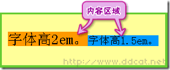

# 线框图 vs 原型 vs 视觉稿
| | 保真度 | 花费 | 用途 | 特征 |
| --- | --- | --- | --- | --- |
| 线框图 | 低 | ￥ | 文档，快速交流 | 手绘草图，黑白灰，代表用户界面 |
| 原型 | 中 | ￥￥￥ | 用户测试，后续界面的复用 | 可以交互 |
| 视觉稿 | 高 | ￥￥ | 收集反馈，获得认可 | 静态视觉设计 |  

- [线框图、原型和视觉稿的区别](http://cuikai-wh.com/blog/2460)
- [Wireframing, Prototyping, Mockuping – What’s the Difference?](https://designmodo.com/wireframing-prototyping-mockuping/)

# 字符宽度和高度不等于字体大小

- ascender：字母的上半出头部分
- steam：词干
- terminal：末端
- ear：耳朵
- bowl：碗状物
- crossbar：闩
- counter：？
- bracket：？
- Link / Neck：？
- Loop / Lobe：？

参考

- [Why doesn't font-size equal width and height in CSS?](http://stackoverflow.com/questions/29143234/why-doesnt-font-size-equal-width-and-height-in-css)

# 顶线，底线，中线，基线，行高，行距

- 顶线 / 中线 / 底线：用来确定文字行的位置
- 基线：一行字横排时下沿的基础线，基线并不是汉字的下端沿，而是英文字母x的下端沿
- 行高：文本行的基线间的距离
- 行距：行高与字体尺寸的差

疑问：基线，顶线，中线，底线的位置由什么决定？

- 基线：基线受行高的影响

# 内容区域 vs 行内框

- 内容区域：一行中的每个元素都有一个内容区域，它是由字体尺寸决定
- 行内框：行内元素会生成一个行内框，但它只是个概念，是无法显示出来的，在没有其他因素影响的时候，行内框等于内容区域，而设定行高则可以增加或者减少行内框的高度，即：将行距的值除以 2，分别增加到内容区域的上下两边。
