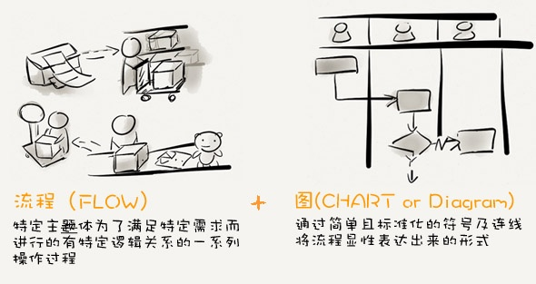
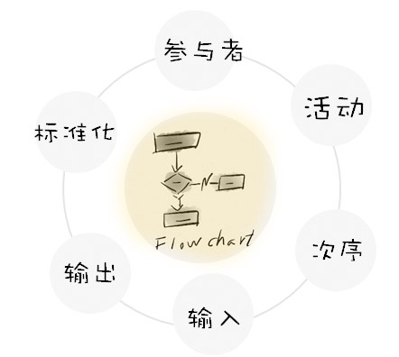
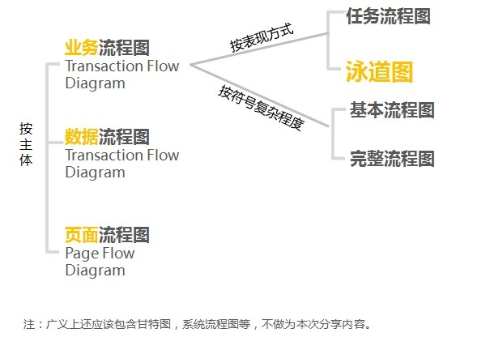
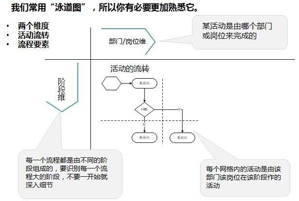
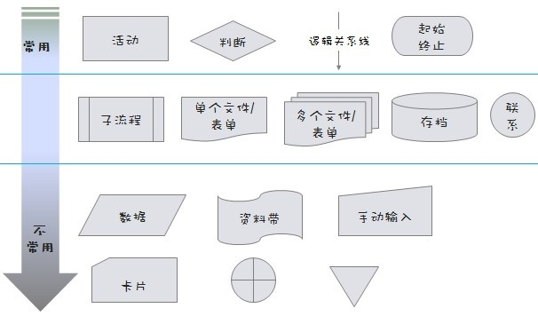
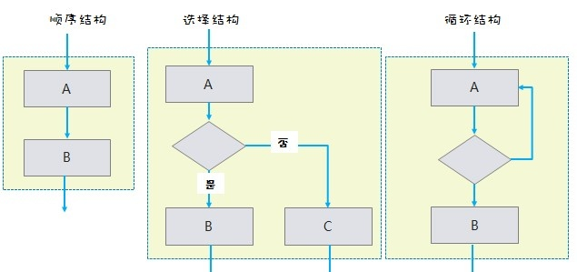
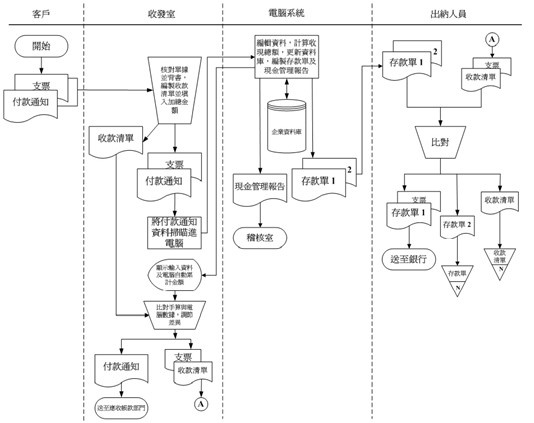

- [如何绘制业务流程图](http://www.uml.org.cn/RequirementProject/201207111.asp)
- http://www.woshipm.com/tag/%E6%B5%81%E7%A8%8B%E5%9B%BE
- [程序流程图的画法](http://blog.sina.com.cn/s/blog_6a1837e901013crm.html)
- [如何高效地绘制流程图](https://www.edrawsoft.com/cn/How-to-draw-flowchart.php)

# 流程图是什么？

流程 + 图

- 流程：是指特定主体为了满足特定需求而进行的有特定逻辑关系的一系列操作过程，流程是自然而然就存在的。但是它可以不规范，可以不固定，可以充满问题。所以就会造成看似没有流程。
- 图：是将基本固化有一定规律的流程进行显性化和书面化，从而有利于传播与沉淀、流程重组参考。

备注：

1. 只要有事情和任务，流程就会有，但是并不是所有的流程都适合用流程图的方式去表现，适合用流程图去表现的流程是一定程度固定的有规律可循的，流程中的关键环节不会朝令夕改的。
2. 区分用例图，时序图，站点地图，线框图等其他图表。

## 流程图要素

- 参与者：谁在这个流程中？
- 活动：做了什么事？
- 次序：这些事情发生的前后顺序如何？
- 输入：每项活动开始取决于什么样的输入物或数据？
- 输出：每项活动结束后，会输入什么样的文档或数据传递给下一方？
- 标准：采用一套标准化的符号用以传递你的流程图，从而使受众更快明白

## 流程图分类

- 业务流程

    - 按表现划分
    
        - 任务流程图：以部门和岗位为单位
        - 泳道图：以活动为单位的流程图

    - 按符号复杂程度：基本流程图，完整流程图

- 数据流程
- 页面流程

## 流程图图示

## 流程图结构

# 为什么需要流程图？
TODO

# 如何绘制流程图？
## 业务路程图
TODO

## 数据流程图

## 页面流程图
- [谈谈页面流程图（附案例）](http://www.woshipm.com/pmd/27239.html)
- [“页面流程图”（非“原型”，非“流程图”），对“比较复杂”的流程（如循环），如何处理？都绘制？](http://www.pmcaff.com/entry?id=1000000000155444&from=related&pmc_param%5Bentry_id%5D=1000000000139154)
- [页面流程图](http://www.maiziedu.com/wiki/prototype/page/)
- [页面流程图](http://www.maiziedu.com/wiki/pmdesign/flow/)
- [页面流程图怎么不可以自己画连接线](http://www.modao.cc/posts/4056?page=1)
- [推荐！交互设计那些事儿（二）](http://www.uisdc.com/interaction-design-4)
- [谈谈页面流程图](http://ju.outofmemory.cn/entry/171306)

# 流程图案例
泳道图

# 流程图绘制工具
- 交互设计师：Axure
- 项目经历：Visio

- [Processon](http://www.processon.com/)

- [用什么软件画流程图？](https://www.zhihu.com/question/20177573)
- [Visio(流程图绘制软件)的免费替代品](https://xbeta.info/visio-alternative.htm)
- [9款国内外垂直领域的在线作图工具[可代替visio]](http://www.jianshu.com/p/30201cef8cca)
- [介绍几个在线画流程图的工具](http://www.cnblogs.com/damonlan/archive/2012/03/29/2410301.html)

# TODO
- [流程图里的形状符号的代表意义](https://www.douban.com/note/310371289/)
- [PM小技巧——流程图&产品原型](http://www.woshipm.com/pmd/270300.html)
- [交互设计流程图怎么画？](http://www.woshipm.com/ucd/137757.html)
- [产品经理业务流程图的绘制流程分享](http://www.woshipm.com/pmd/3864.html)
