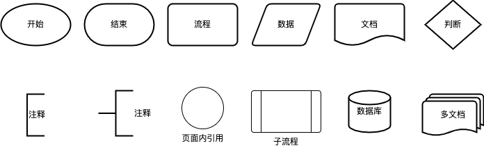

# 流程图

## 基础

### 流程图符号

- 开始或结束：表示流程图的开始或者结束
- 流程：即流程处理，表示具体某一个步骤或者操作
- 判定：表示条件标准
- 文档：表述输入或输出的文件
- 子流程：即已定义流程，表示决定下一个步骤的一个子流程
- 数据库：即归档，表示文件和档案的存储
- 注释：表示对已有元素的注释说明
- 页面内引用：即连接，表示流程图之间的接口

### 三大结构

- 顺序结构：在顺序结构中，各个步骤是按先后顺序执行的，这是一种最简单的基本结构。
- 选择结构：选择结构又称分支结构，选择结构用于判断给定的条件，根据判断的结果判断某些条件，根据判断的结果来控制程序的流程。
- 循环结构：循环结构又称为重复结构，就是流程在一定的条件下，反复执行某一操作的流程结构。循环结构下又可以分为当型结构和直到型结构。

### 注意事项

- 绘制流程图时，为了提高流程图的逻辑性，应遵循从左到右、从上到下的顺序排列；
- 一个流程从开始符开始，以结束符结束。开始符号只能出现一次，而结束符号可出现多次，若流程足够清晰，可省略开始、结束符号；
- 菱形为判断符号，必须要有“是和否（或Y和N）”两种处理结果，意思是说，菱形判断框一定需要有两条箭头流出；且判断符号的上下端流入流出一般用“是（或Y）”，左右端流入流出用“否（或Y）”。
- 同一流程图内，符号大小需要保持一致，同时连接线不能交叉，连接线不能无故弯曲。
- 流程处理关系为并行关系的，需要将流程放在同一高度。
- 必要时应采用标注，以此来清晰地说明流程，标注要用专门的标注符号。
- 处理流程须以单一入口和单一出口绘制，同一路径的指示箭头应只有一个。
- 同一路径的指示箭头应只有一个。
- 流程图中，如果有参考其他已经定义的流程，不需重复绘制，直接用已定义流程符号即可。

## 参考文献

- [画了多年的流程图，你真的画规范了吗？](http://www.woshipm.com/zhichang/2329530.html)
- [UML创建流程图教程（带有符号、指南和示例）](https://www.helloworld.net/p/0806985728)
